# Let's Get Social

## Table of Contents
* [Description](#description)
* [Technologies Used](#technologies-used)
* [Installation](#installation)
* [Usage](#usage)
* [Contributing](#contributing)
* [Images for API Routes](#images-for-api-routes)
* [Video](#video)
* [Questions](#questions)

### Description
A social netowrk API that uses a NoSQL database to enable a website to handle large amounts of data

### Technologies Used
* Node.js
* Express.js
* MongoDB
* Mongoose
* JavaScript

### Installation
1. Clone repository
2. Type `npm i` or `npm install` to install all dependencies
3. Type `npm start` or `node server` to start database

### Usage 
All dependencies must be installed prior to using application

### Contributing 
Pull requests are reviewed

### Images for API Routes

GET Users: localhost:3001/api/users
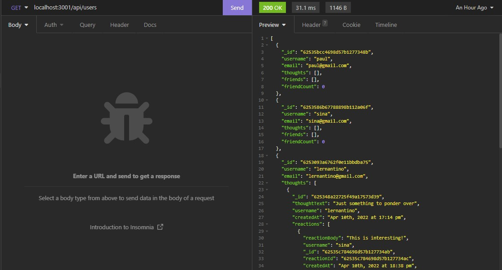

GET Thoughts: localhost:3001/api/thoughts
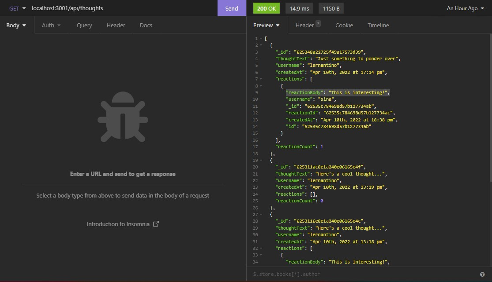

GET One User: localhost:3001/api/users/:id
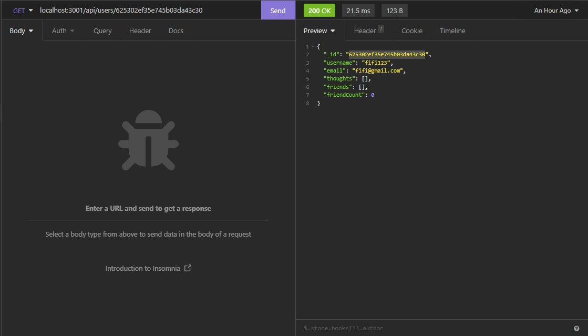

GET One Thought: localhost:3001/api/thoughts/:id
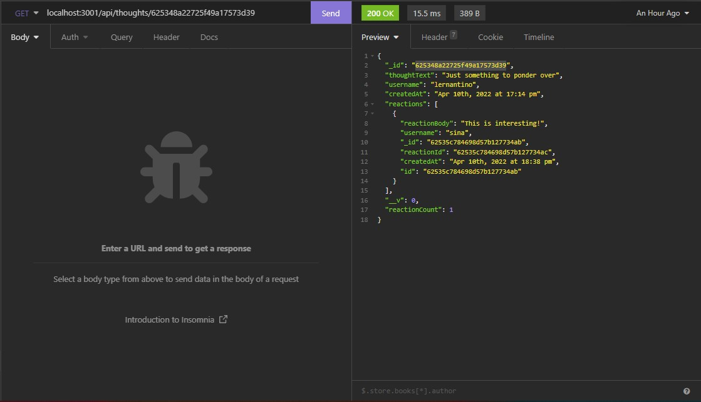

POST User: localhost:3001/api/users
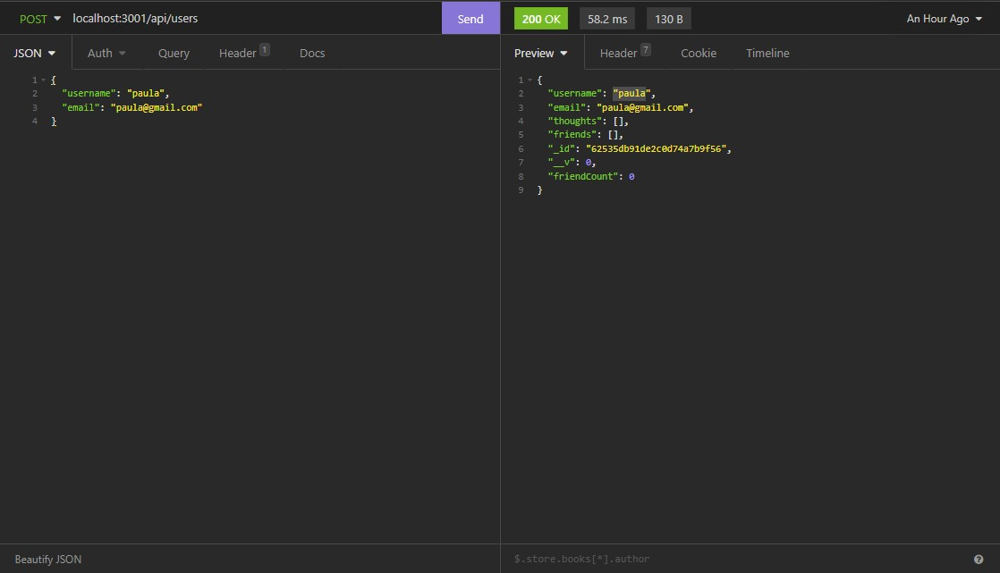

PUT User: localhost:3001/api/users/:id
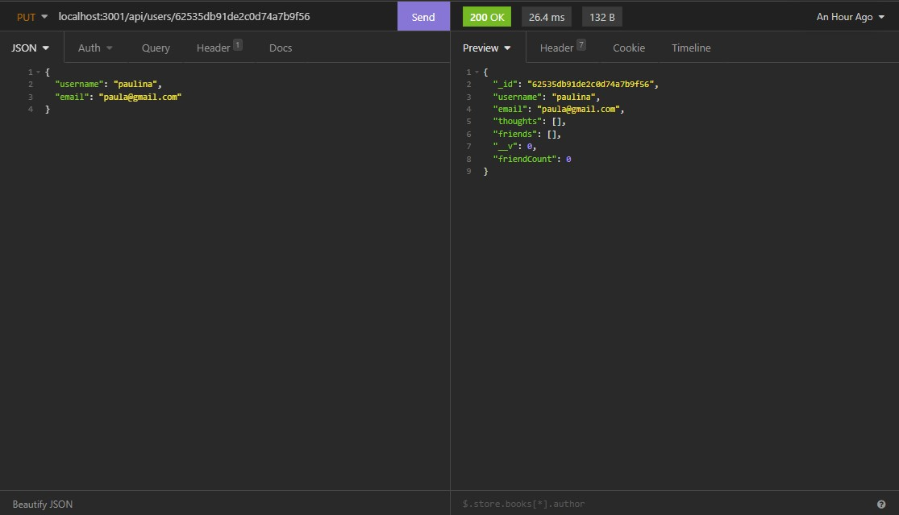

DELETE User: localhost:3001/api/users/:id
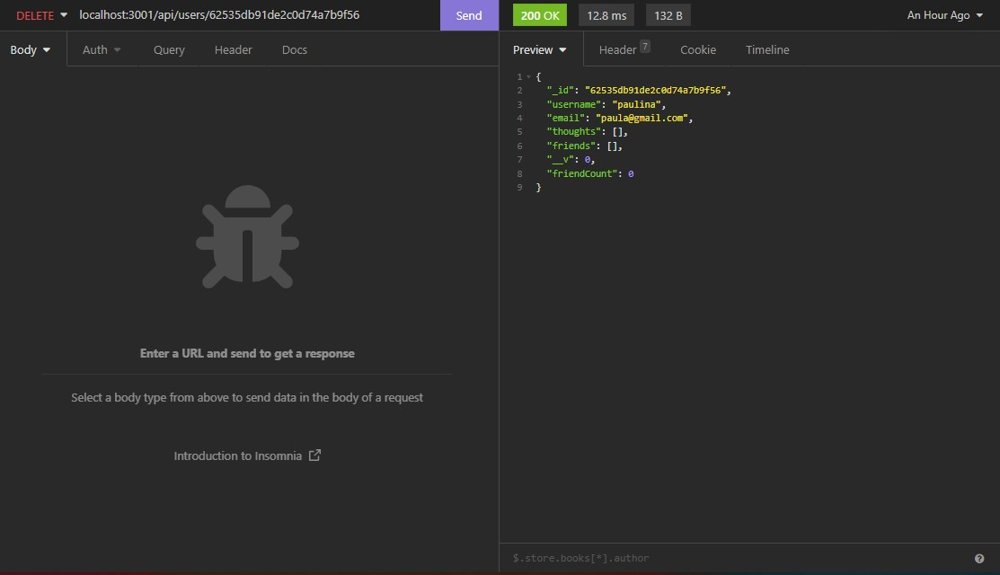

POST Thought: localhost:3001/api/thoughts
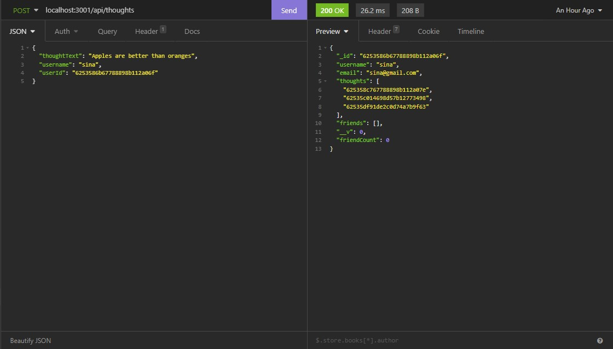

PUT Thought: localhost:3001/api/thoughts/:id
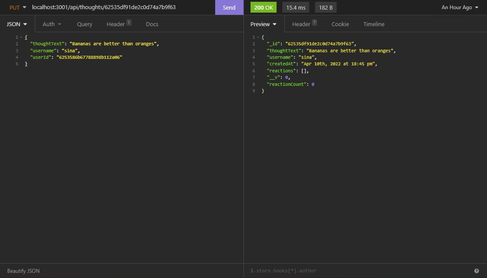

DELETE Thought: localhost:3001/api/thoughts/:id
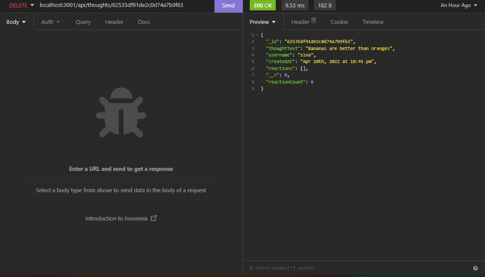

POST Friend: localhost:3001/api/users/:id/friends/:friendId
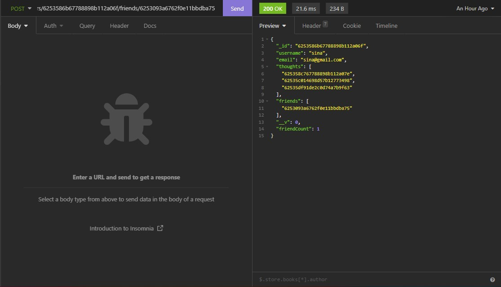

DELETE Friend: localhost:3001/api/users/:id/friends/:friendId
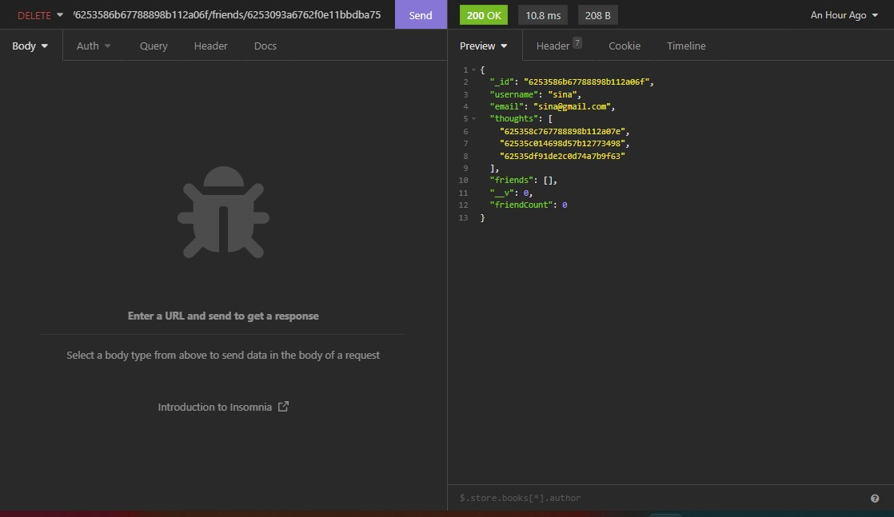

POST Reaction: localhost:3001/api/thoughts/:id/reactions
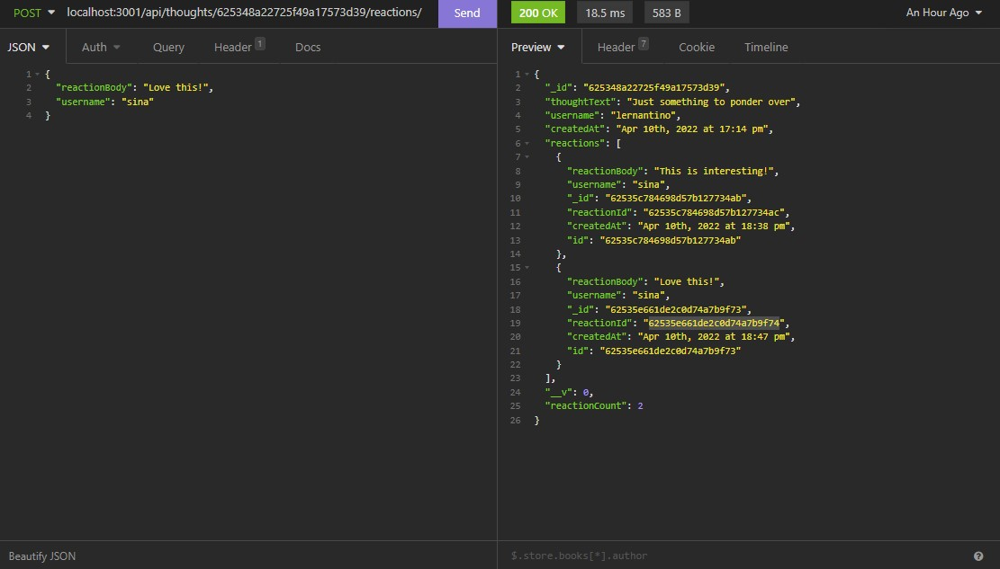

DELETE Reaction: localhost:3001/api/thoughts/:id/reactions/:reactionId
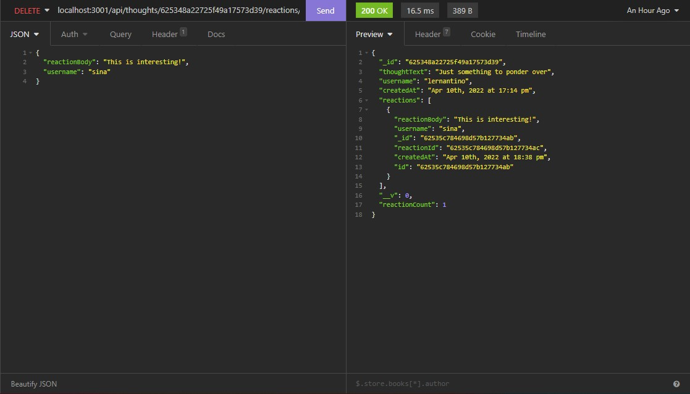

### Video
https://drive.google.com/file/d/1SI3c8AdFWnzsqE1IEE9Nz9ZzQmCPcTZm/view?usp=sharing

### Questions
If you have any questions about opening an issue or the repository itself, please contact me at ajmarrocco@gmail.com. Please visit https://github.com/ajmarrocco for more of my projects!